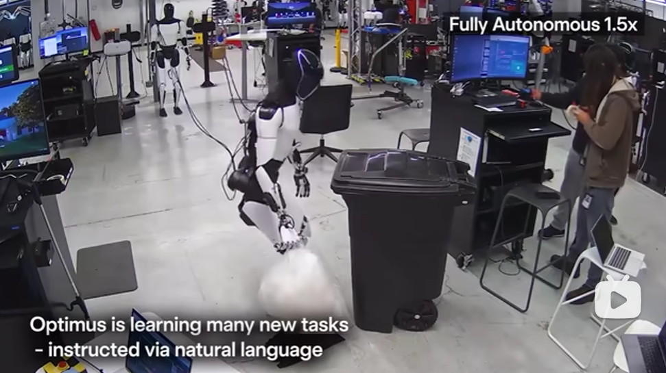

**机器人课程（共11周）**

# 技术导论与环境搭建（第1周）


## 课程介绍与计划


## 引言


**欢迎来到人形机器人的世界——探索下一代颠覆性技术**


同学们好，欢迎选修《人形机器人技术导论》这门课程。


如果说计算机、智能手机和新能源汽车定义了过去的数十年，那么人形机器人，这一集人工智能、高端制造、新材料等前沿技术于一体的结晶，正蓄势待发，成为开启未来的关键。本课程将作为你们的向导，共同探索这个令人兴奋的新兴领域。


### **一、 从科幻到现实：人形机器人的发展简史**


人形机器人的梦想由来已久，其发展历程大致可分为三个关键阶段：


- **早期探索 (1970s-2000s)：** 一切始于实验室中的蹒跚学步。从日本早稻田大学的全球首台全尺寸人形机器人 **WABOT-1** 证明可行性，到本田公司的 **ASIMO** 以其流畅的行走能力惊艳世界，这个阶段的先驱者们为机器人的稳定步行奠定了理论基础。


- **技术突破 (2000s-2020)：** 这是属于“网红”机器人的时代。以波士顿动力公司的 **Atlas** 为代表，机器人展示了跑酷、后空翻等惊人的动态平衡与运动能力，极大地突破了人们对机器运动极限的想象。同时，机器学习技术开始融入，让机器人具备了初步的学习和适应能力。


[](https://www.bilibili.com/video/BV1ay4y1D7WM/?spm_id_from=333.337.search-card.all.click&vd_source=916449cf2555535fc5fea68741c33019)


- **产业化加速 (2020-至今)：** 我们正处在这个激动人心的时代。随着以 **ChatGPT** 为代表的**大语言模型 (LLM)** 和 **“具身智能”** 概念的爆发，机器人迎来了“智慧大脑”的革命性升级。特斯拉的 **Optimus** 、宇树科技的G1等产品正加速从实验室走向工厂和现实生活，预示着一个人形机器人产业化的新纪元已经到来。


特斯拉Optimus 

[](https://www.bilibili.com/video/BV1VxJqzfELu/?spm_id_from=888.80997.embed_other.whitelist&t=56.333447&bvid=BV1VxJqzfELu)


宇树G1机器人

[](https://www.bilibili.com/video/BV14XaHzuEkM/?spm_id_from=888.80997.embed_other.whitelist&bvid=BV14XaHzuEkM)

 


### **二、 不止于工厂：人形机器人的广阔应用场景**


人形机器人拥有与人类相似的形态，这使其能够无缝融入为人类设计的环境中，应用潜力巨大：


- **智能制造：** 在汽车、电子等生产线上，它们将代替人类完成重复性、高精度的装配、搬运与质检工作。
- **社会服务：** 在商场、酒店、医院等场所，它们可以担任导购、接待、陪护等角色，提供人性化的服务。
- **医疗康复：** 它们可以作为康复训练的助手，辅助老年人起居，甚至在未来参与到精密的手术辅助中。
- **极限探索：** 在太空、深海、灾后救援等高危环境中，人形机器人将代替人类执行勘探、维修和救援任务，保障生命安全。


### **三、 揭秘核心：驱动机器人的关键技术**


要让一台机器人像人一样行动和思考，背后是一个复杂而精妙的技术体系。我们可以将其简化为四大核心部分：


1. **强健的“身躯”—— 机械结构与材料：** 这是机器人的骨骼与肌肉。通过仿生设计、轻量化材料（如碳纤维）和高精度的驱动器（电机、减速器），实现机器人灵活而有力的运动。
2. **敏锐的“感官”—— 感知系统：** 这是机器人的眼睛和皮肤。依靠**视觉（摄像头）、力觉与触觉传感器**等多传感器融合技术，机器人能够精准感知并理解周围的三维世界。
3. **协调的“小脑”—— 运动控制：** 这是机器人平稳行走和操作的关键。核心算法致力于解决**双足步行、动态平衡和全身协调**等难题，确保机器人在复杂地形中也能行动自如。
4. **智能的“大脑”—— 人工智能与认知：** 这是人形机器人的灵魂。近年来，随着**大语言模型 (LLM)** 和**具身智能**技术的发展，机器人不仅能“听懂”人类的复杂指令，还能进行推理、规划任务，并从与环境的交互中不断学习。


本课程将带领大家深入探索以上这些激动人心的领域。我们不仅会学习理论知识，更会通过实践项目，让大家对人形机器人的设计、控制与应用有一个直观的认识。这不仅是一门前沿的技术课程，更是一次通往未来的探索之旅。


欢迎大家加入，共同开启人形机器人的新篇章！

 


## 幻尔TonyPi-Pro机器人简介


### 基本信息


### 启动机器人


## 环境准备

参考[软件环境安装文档](./docs/01_dev_env.md)中[python安装](./docs/01_dev_env.md/#python安装)与[VSCode安装](./docs/01_dev_env.md/#VSCode安装)。


## 练习

+ 完成[软件环境安装文档](./docs/01_dev_env.md)中其它软件的安装
+ 使用手柄控制机器人
+ 提出三个任何与本节内容相关的问题，并自行回答

# Python与机器人基本控制（第2周）

### 打印输出与注释

```python
"""
TonyPiPro基于树莓派5B开发，它在TonyPi机器人的基础上做了很多升级，使
得TonyPi
Pro不仅保留了之前所有的功能，还拓展出了更多有趣的AI创意玩
法，如跨栏越障、上下台阶、智能抓取、口罩识别、多台群控等等。它不仅能
满足用户对机器视觉、机器人运动学等算法的学习和验证，还为传感器应用、
视觉抓取等二次开发提供快速、便捷的集成方案。
"""
# 输出机器人相关信息
print("欢迎来到人形机器人实验室！")
print("今天的主角是 TonyPi 机器人")

```


### python数据类型

#### 基本类型

```python
# 整型 (int)：机器人自由度数量
degree_of_freedom = 20   # 机器人有 20 个自由度

# 浮点型 (float)：机器人身高（单位：米）
robot_height = 0.373   # 机器人身高 0.65 米

# 布尔值 (bool)：机器人是否已开机
robot_power_on = True   # True 表示已开机，False 表示关机

# 字符串 (str)：机器人名称
robot_name = "TonyPi"

```


#### 容器与遍历

```python
# 列表 (list)：机器人常用动作
robot_actions = ["前进", "后退", "挥手", "点头"]

# 字典 (dict)：机器人传感器数据
robot_sensors = {
    "camera": "480P分辨率摄像头",
    "舵机": "LX-824HV高压总线舵机和LFD-O1M防堵转舵机",
    "控制板": "树莓派主板和树莓派扩展板"
}

# 元组 (tuple)：机器人电池信息（电压 V,容量 mAh，电池类型）
robot_battery = ('11.1V', '2000mAh','10C锂电池')

```


#### 类型转换与基本运算符

```python
# 类型转换：把整型转成字符串
servo_str = str(robot_servo)
print("机器人有 " + servo_str + " 个舵机")

# 基本运算符：计算机器人运动总时长
walk_time = 5   # 前进 5 秒
back_time = 3   # 后退 3 秒
total_time = walk_time + back_time
print("机器人运动总时长:", total_time, "秒")

```


### 流程控制

#### if条件判断

```python
robot_battery_level = 25  # 电池电量百分比

if robot_battery_level < 20:
    print("⚠️ 电量不足，请及时充电！")
else:
    print("✅ 电量充足，可以继续运行")

```


#### for/while循环

```python
# for 循环：执行一组动作
actions = ["站立", "前进", "挥手"]
for act in actions:
    print("执行动作:", act)

# while 循环：机器人连续行走，直到到达目标点
distance = 0
while distance < 5:
    print("机器人向前走一步")
    distance += 1
print("机器人到达目标点")

```


#### 嵌套循环与break/continue

```python
# 模拟机器人在两层楼中巡逻
floors = [1, 2]
rooms = ["101", "102", "103"]

for f in floors:
    for r in rooms:
        if r == "102" and f == 2:
            print("遇到障碍物，跳过房间", r)
            continue
        if r == "103" and f == 2:
            print("紧急任务，结束巡逻！")
            break
        print(f"机器人正在巡逻 {f} 楼 {r} 房间")

```


### 函数与模块

#### 函数定义与调用

```python
def robot_say(message):
    print("🤖 机器人:", message)

# 调用函数
robot_say("你好！我是 TonyPi")

```


#### 传入参数与返回值

```python
def move_forward(steps):
    print(f"机器人前进 {steps} 步")
    return steps * 0.3  # 每步 0.3 米，返回总距离

distance = move_forward(10)
print("机器人总共移动了", distance, "米")

```


### python内置模块导入

```python
import time

print("机器人启动中...")
time.sleep(2)  # 延时 2 秒
print("启动完成 ✅")

```


### 类与面向对象基础

#### 类的定义与实例化

```python
class Robot:
    def __init__(self, name, servo_count):
        self.name = name
        self.servo_count = servo_count

# 创建机器人对象
robot = Robot("TonyPi", 20)
print("机器人名称:", robot.name)
print("舵机数量:", robot.servo_count)

```


#### 属性与方法

```python
class Robot:
    def __init__(self, name, battery):
        self.name = name
        self.battery = battery  # 电池电量

    def speak(self, msg):
        print(f"{self.name} 说:", msg)

    def charge(self, amount):
        self.battery += amount
        print(f"{self.name} 已充电，现在电量 {self.battery}%")

# 使用类
robot = Robot("TonyPi", 50)
robot.speak("大家好，我是TonyPi！")
robot.charge(30)

```


### python控制机器人基本运动

水平行走、抓握、转头等。


## 练习

+ 以面向对象的思想，加上机器人的基本控制，设计一个机器人的功能模块
+ 提出三个任何与本节内容相关的问题，并自行回答


# OpenCV与机器人视觉（第3周）

## 打开机器人摄像头

实时获取机器人看到的画面。

## 图像预处理

灰度化：减少计算量

模糊：去除噪声

边缘检测：用于检测地面边界、障碍物

## 形状与轮廓检测

检测地上的物体（比如足球、障碍物）

## 颜色识别

让机器人识别红色球 → 追球运动

颜色标签识别

## 人脸检测

机器人识别人类，做互动（比如挥手、打招呼）。

## 目标跟踪

机器人锁定目标位置 → 头部/身体转向


## 练习

+ 使用本节内容设计一个与机器人视觉相关的功能模块
+ 提出三个任何与本节内容相关的问题，并自行回答


# 机器人语音识别与语音合成（第4周）

## 语音模块安装与接线

## 语音控制TonyPi

## 颜色识别与播报

## 语音API

## 开源项目介绍

### Index-TTS(TTS)

### sherpa-onnx(ASR)

## 练习

+ 结合本节依旧之前所学内容，设计一个语音相关的功能模块
+ （可选）使用Index-TTS与sherpa-onnx替代机器人原本的语音模块进行交互
+ 提出三个任何与本节内容相关的问题，并自行回答


# 机器人传感器（第5周）

## 风扇模块实验

## 触摸传感器实验

## MP3模块实验

## 超声波传感器实验

## 点阵模块实验

## 光线传感器实验

## 练习

+ 结合本节以及之前所学内容，设计一个传感器相关的功能模块
+ 提出三个任何与本节内容相关的问题，并自行回答

# 机器人AI模块（第6周）

## YOLO目标检测

模型部署、训练

## LLM大语言模型

基本概念、原理、主流模型调用

## MCP Server与Client

编写MCP服务端与客户端，让大模型能调用自定义的工具。


## 练习

+ 结合本节以及之前所学内容，设计一个大模型+MCP的功能模块
+ 提出三个任何与本节内容相关的问题，并自行回答


# 智能搬运与田径跨栏（第7周）

## 智能巡线

## 道具安装以及地图的铺设

## 爬台阶

## 跨栏运动

## 田径运动

## 练习

+ 使用机器人完成本节内容
+ 提出三个任何与本节内容相关的问题，并自行回答


# 大模型与机器人整合（第8周）

## 系统设计

## 示例项目：语音/手势控制

根据语音与手势与机器人进行交互。

## 练习

+ 完成一个大模型与机器人整合的系统设计
+ 提出三个任何与本节内容相关的问题，并自行回答

# 综合实践（第9-10周）

方案一：田径跨栏+物品搬运。

方案二：自主设计一个作品（包含机器人运动、视觉、语音、大模型）。

## 练习

+ 选择一个方案完成作为结课大作业

# 作品展示（第11周）

同学展示作品。


